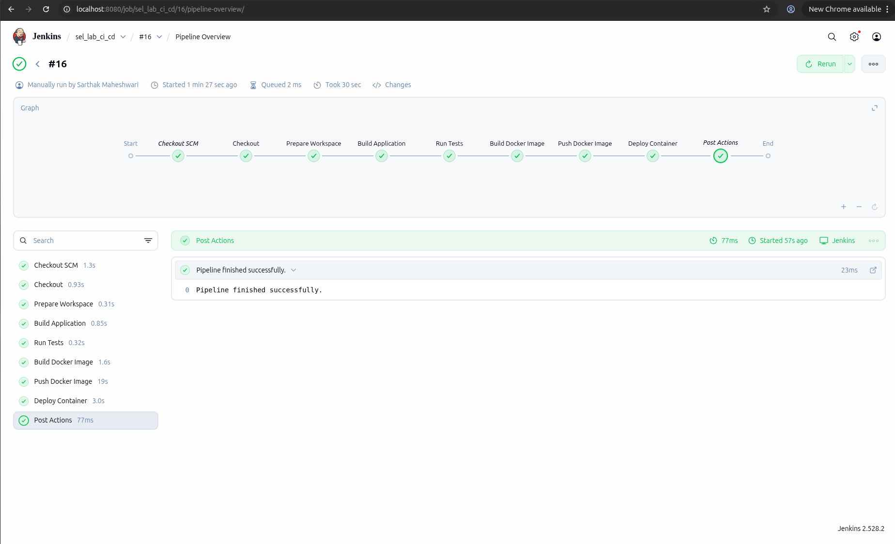
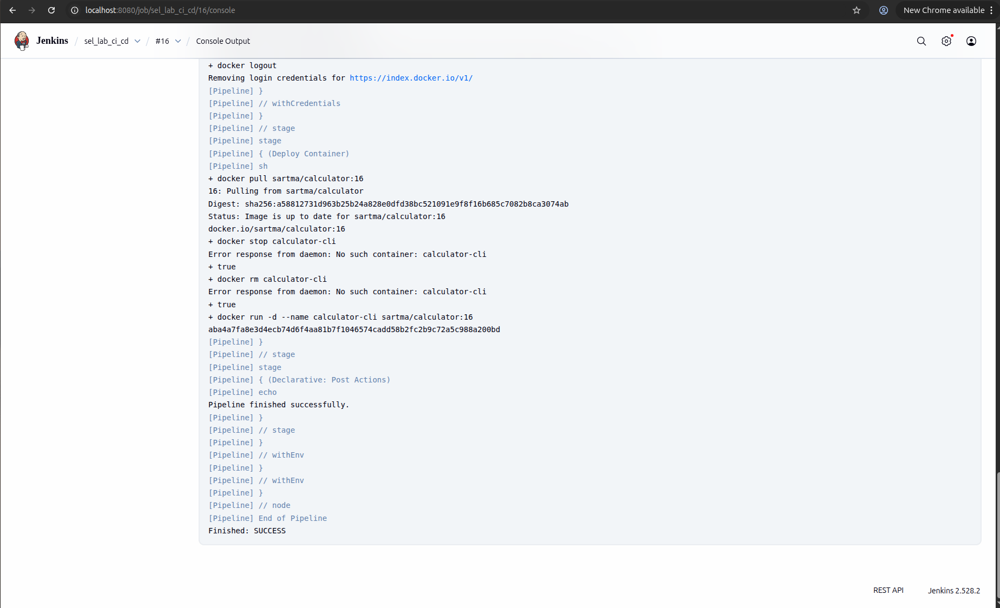

# Calculator Project

A simple Java-based command-line calculator application that supports basic arithmetic operations. This project demonstrates a complete CI/CD pipeline using Jenkins and Docker.

## Docker Hub Repository

[https://hub.docker.com/r/sartma/calculator](https://hub.docker.com/r/sartma/calculator)

*Figure 1: Jenkins Pipeline Overview*

*Figure 2: Successful build execution in Jenkins*

## Pipeline Overview

The Jenkins pipeline automates the following stages:
1. **Checkout**: Pulls code from GitHub.
2. **Prepare Workspace**: Cleans up previous builds.
3. **Build Application**: Compiles the Java source code.
4. **Run Tests**: Executes unit tests.
5. **Build Docker Image**: Creates a Docker image with the compiled application.
6. **Push Docker Image**: Pushes the image to Docker Hub.
7. **Deploy Container**: Deploys the container locally.

